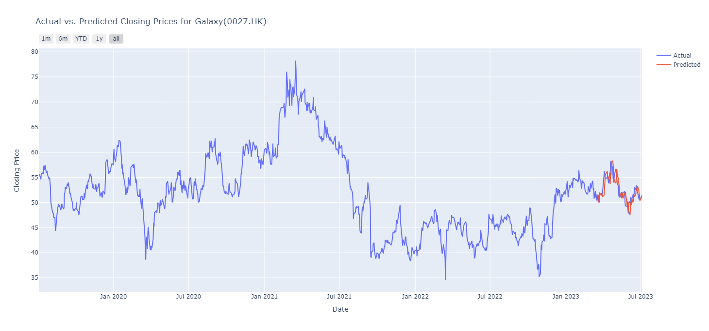

## LSTM-Project
This is an implementation of a Long Short-Term Memory (LSTM) model using PyTorch to predict the closing stock price of a particular stock. The model is trained on historical stock market data, and it learns to predict the closing price for the next day based on the previous day's data.

This is also a first Neural Network Model implemenation I built; furthermore, I might keep updating this repository if necessary.
# Table of Content
  * Installation
  * Data
  * Model
  * Result
# Installation
To run this project, it is needed to install the following libraries:
 * PyTorch
 * NumPy
 * Pandas
 * Plotly
 * yfinance
# Data 
The stock market dataset used in this project is obtained from Yahoo Finance. The dataset contains daily stock prices and volumes for a particular stock, and it covers a period of several years.

When using historical stock market data, it's important to ensure that the data is accurate and reliable. Some sources of historical stock market data may contain errors or inaccuracies, so it's important to carefully validate and clean the data before using it for analysis or machine learning. Therefore, scaling the data is essential.

# Model
The LSTM model used in this project consists of several LSTM layers followed by a output layer. The model is trained using a mean absolute error (MAE) loss function and an Adam optimizer. The model is trained for a fixed number (200) of epochs.

# Result

```
This is the result that comparing the predicted value and actual value.
